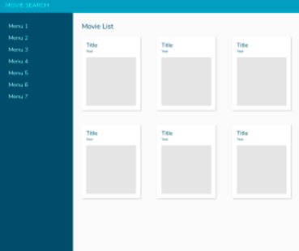
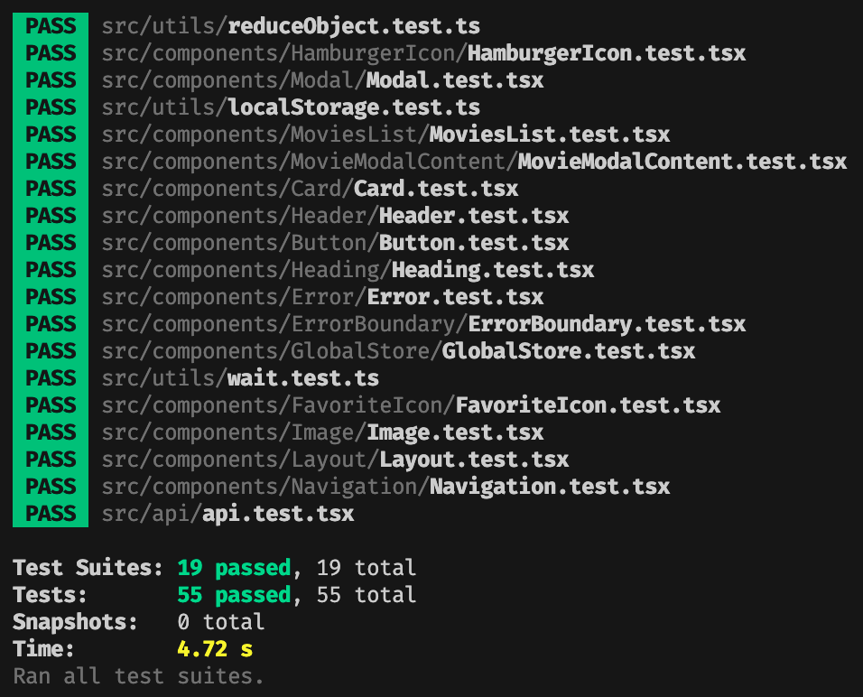

# True Link Frontend Coding Interview

## Overview

**Objective:** Build a responsive movie search page with results powered by [OMDb API](http://www.omdbapi.com/)

- Demonstrate the ability to create
  - Frontend web experiences that reproduce design prototypes
  - Dynamic experiences that integrate with a back-end API
  - Responsive web applications
  - Accessible web applications

## How to

- Run the project:

  - Clone the repo
  - Create a `.env` file in the project's root directory with the following contents:
    ```txt
    REACT_APP_OMDB_API_KEY=<REPLACE WITH YOUR API KEY>
    ```
  - "&lt;REPLACE WITH YOUR API KEY&gt;" should be replaced with your API key.
  - Ensure you have [Node.js](https://nodejs.org/en/) 14 or higher installed
  - From the project's root directory, issue the following terminal commands
    - `npm install`
    - `npm start`

- Run the Cypress tests

  - Execute the steps above to run the project
  - From another terminal window, within the project's root directory, issue the following terminal command
    - `npm run test:cy`
  - When the Cypress test runner appears, click on the play button
  - A version of Chromium will appear and the tests will start

- Run the Jest tests

  - From the project's root directory, issue the following terminal command
    - `npm test`
    - Follow the terminal options to run all tests or filter to run selected tests
  - _Note:_ you do not have to "Run the project" first in order to run Jest tests

## Mockups

### Mobile


<br/>

### Desktop



<br/>

## Showcase

### Mobile Screen Takeover


<br/>

### Desktop Modal


<br/>

### Favorites


<br/>

### Cypress Tests


<br/>


<br/>

### Jest Tests



<br/>

## Roadmap

- "Remove all favorites" button
- Filter favorites and search results
